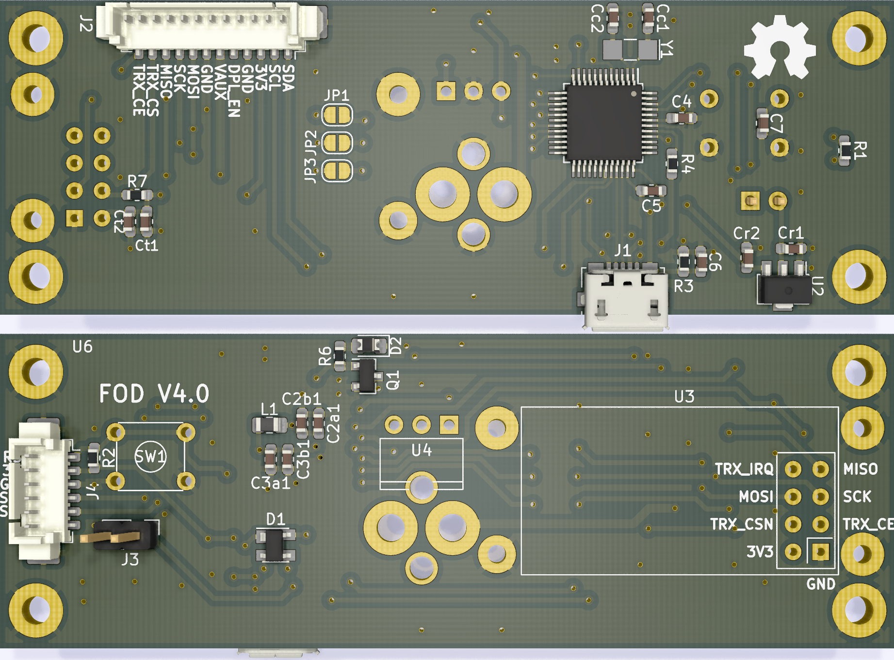

# Femto-satellite Orbital Deployer (FOD)

This repository contains the PCB design and the source code of a femto-satellite orbital deployer or FOD. This device works by cutting a fishing line with Nichrome wire. The fishing line is normally pressing a hinge lever. When the line is cut, the hinge lever is released end the microcontroller can detect the release status.

The PCB has a transceiver (RFM69HCW) to communicate with the femto-satellite once it is released and a microSD slot to save data. There is also a LED showing the release status, and a reset button. The energy and the comunication with the OBC is done through a molex cable with a picoblade connector.

This new version is designed for CubeSats of 2U or more. It is intended to be used as a type A interstage panel, so that it leaves more space inside the CubeSat for other payloads.

Current version: 3.0.0

### Supported software:

* KiCAD 5.99.0

### Supported hardware:

* Microcontroller: ATSAMD21G18
* Transceiver: RFM69HCW
* Hinge lever: AV4524
* Mosfet: PMV16XNR

### Contact:

* Name: Matías Vidal Valladares
* e-mail: matias.vidal.v@gmail.com
